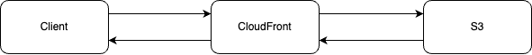
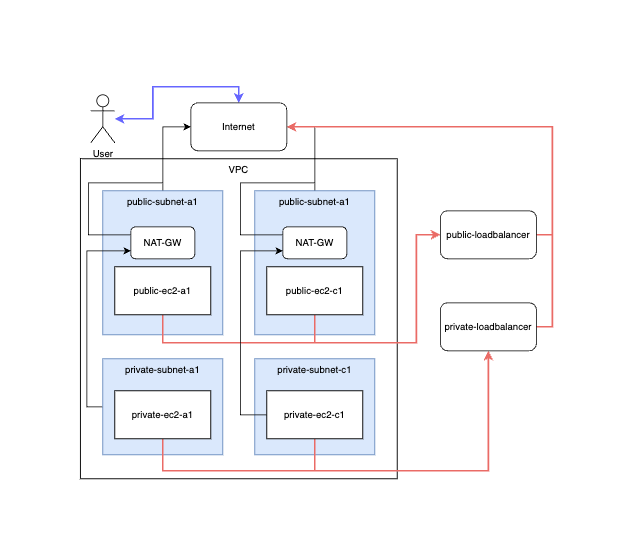

# 스스로 구축하는 AWS 클라우드 인프라 - 기본편

## 서버리스 정적 웹사이트 호스팅 및 성능 가속화

### S3

Amazon Simple Storage Service(Amazon S3)는 아마존에서 제공하는 객체 스토리지 서비스이다. 주로 웹 사이트, 모바일 어플리케이션, 백업 및 복원, 빅데이터 분석 등 다양한 곳에서 원하는 양의 데이터를 저장하고 보호하고 있다.

### CloudFront

Amazone CloudFront는 .html, .css, .js 등 정적 및 동적 컨텐츠를 더 빨리 배포할 수 있도록 지원하는 서비스이다. 사용자가 컨텐츠를 요청하면 가장 빠른 엣지에서 라우팅 되어 가장 빠른 속도로 컨텐츠가 제공 될 수 있게 한다.

### CloudFront를 통한 웹사이트 성능 가속

위와 같이 CloudFront에서 S3의 컨텐츠를 미리 캐시하여 Client가 보다 빠른 응답을 받을 수 있게 구성할 수 있다.

---

## LAMP 웹 서버 및 Application Load Balancer 구성

### VPC

Amazon Virtual Private Cloud(Amazon VPC)를 이용하면 사용자가 정의한 가상 네트워크로 AWS의 리소스들을 이용할 수 있다. 이 가상 네트워크는 AWS의 확장 가능한 인프라를 사용한다는 이점이 있다. VPC는 서브넷을 구성하고 IP주소를 지정 할 수 있으며 라우팅 테이블을 이용하여 트레픽을 제한 할 수 도 있다.

## EC2

Amazon Elastic Compute Cloud(Amazon EC2)는 클라우드에 확장가능한 컴퓨팅 용량을 제공하는 서비스이다. 초기 투자 없이 빠르게 서비스를 배포할 수 있다. 또한 원하는 수의 가상 서버를 구축하고 Amazon의 리소스들을 같이 활용하여 관리할 수 있다.

### AMI

Amazon Machine Image(AMI)는 인스턴스를 시작하는데 필요한 정보를 포함한 Image이다. 같은 스펙의 여러 인스턴스가 필요할 때 한번에 만들 수 있다.

### 라우팅 테이블

라우팅 테이블에는 네트워크 트래픽을 전달할 위치를 결정하는데 사용되는 규칙을 포함한다. Amazon의 라우팅 테이블은 VPC내의 각 서브넷간 트래픽 흐름을 제어한다. 

### 인터넷 게이트웨이

인터넷에 연결할 게이트웨이를 지정할 수 있다. 라우팅 테이블을 통해 인터넷에 연결할 서브넷을 지정할 수 있다.

### 보안 그룹

보안 그룹을 통해 연결된 리소스에 들어거나 나가는 트래픽을 제어 할 수 있다. 예를 들면 TCP/80 포트만 들어오게 하거나 나가게 할 수 있다.

### 로드 밸런싱

Aws의 로드 밸런싱은 L4가 아닌 L7스위치 스위치와 유사하다. 즉 HTTP 또는 FTP등  OSI Layer7에서 동작한다. 또한 HTTP의 URL 또는 FTP의 파일명 등 보다 정교한 로드밸런싱을 지원한다. 밸런싱 대상은 대상그룹을 생성하여 지정 할 수 있다.

### NAT 게이트웨이

NAT게이트웨이는 프라이빗 서브넷의 인스턴스가 외부에 연결이 가능하게하고 외부에서의 접속은 차단할 수 있는 서비스이다. 

### LAMP 웹서버 및 LoadBalancer

VPC를 통해 각 서버별 Subnet을 구성하고 EC2 인스턴스를 생성한다. 라우팅 테이블을 각 subnet별로 생성하고 public은 인터넷 게이트웨이와 연결한다. 이렇게 하면 public인스턴스는 외부와 통신이 가능하고 private 인스턴스는 외부와 접속이 불가능하다. 따라서 private에서 외부의 인터넷으로 트래픽이 가고 외부에서는 들어오지 못하도록 NAT gateway를 구성해야한다. 위 그림처럼 public서브넷에 NAT를 구성하여 private 인스턴스가 public subnet을 지나 NAT-GW로 외부에 트래픽을 보낼 수 있게된다.

마지막으로 로드벨런서를 트레픽을 분산처리한다. public과 private을 구분하여 로드밸런서를 만드는데 둘다 인터넷과 연결되어야 하기 때문에 public subnet을 이용하여 각 인스턴스에 연결되도록 한다. 
